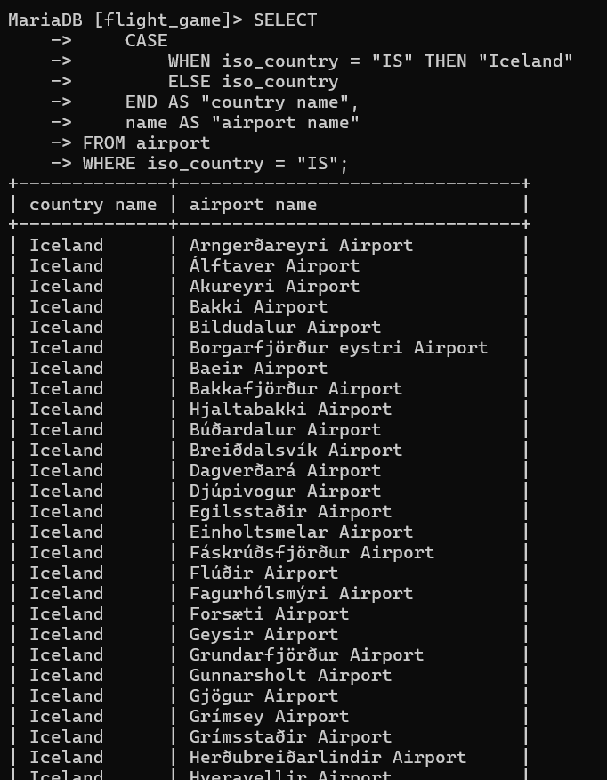
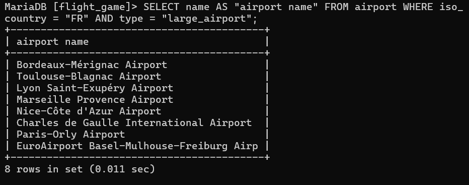
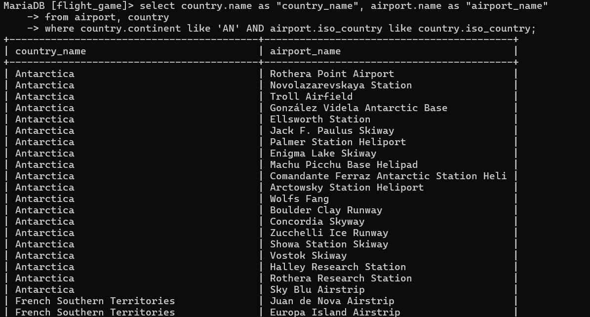
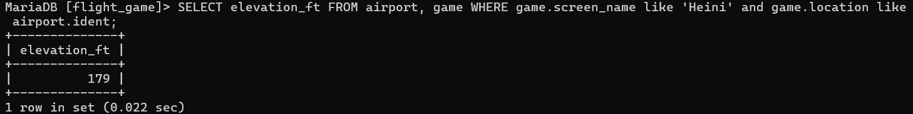
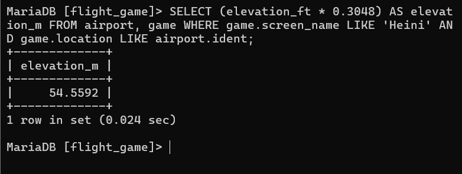
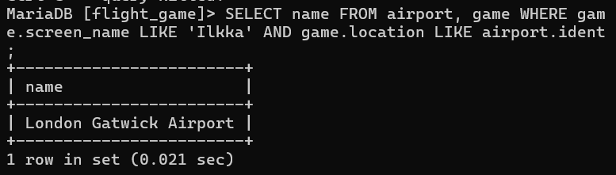
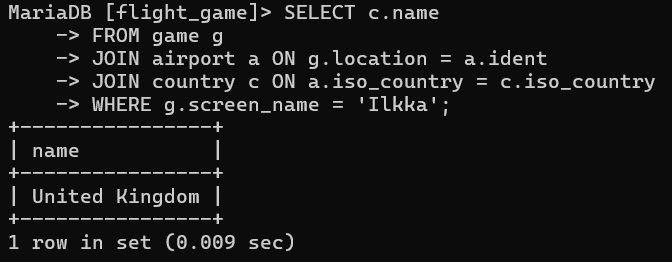
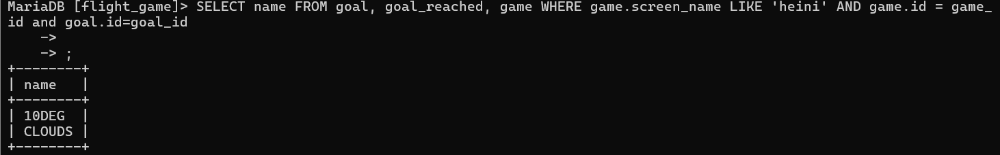
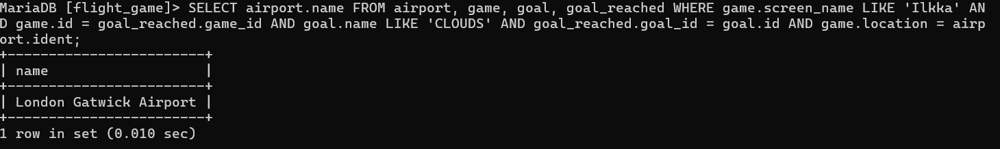
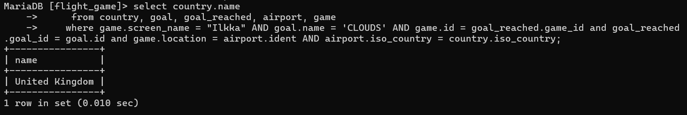

# Viikko 1 Relaatiotietokannan peruskäsitteiden harjoitukset

# Viikko2

### Teht 1

SELECT id, name, description, icon, target, target_minvalue, target_maxvalue, target_text FROM goal;

### Teht 2

SELECT name, type FROM airport WHERE iso_country = 'FI';

### Teht 3

SELECT name FROM airport WHERE iso_country = 'FI' ORDER BY name ASC;

### Teht 4

SELECT name, type FROM airport WHERE iso_country = 'FI' ORDER BY type, name;

### Teht 5

SELECT name FROM country WHERE name LIKE 'F%';

### Teht 6

SELECT name FROM country WHERE name LIKE '%F%';

### Teht 7

SELECT location FROm game WHERE screen_name = 'Vesa';

### Teht 8

SELECT co2_consumed FROM game WHERE screen_name = 'Ilkka';

### Teht 9

SELECT co2_budget FROM game LIMIT 1;

# Viikko 2 Where tehtävät

### Teht 1

SELECT
    ->     CASE
    ->         WHEN iso_country = "IS" THEN "Iceland"
    ->         ELSE iso_country
    ->     END AS "country name",
    ->     name AS "airport name"
    -> FROM airport
    -> WHERE iso_country = "IS";

### Teht 2

SELECT name AS "airport name" FROM airport WHERE iso_country = "FR" AND type = "large_airport";

### Teht 3

select country.name as "country_name", airport.name as "airport_name"
from airport, country
where country.continent like 'AN' AND airport.iso_country like country.iso_country

### Teht 4

SELECT elevation_ft FROM airport, game WHERE game.screen_name like 'Heini' and game.location like airport.ident;

### Teht 5

SELECT (elevation_ft * 0.3048) AS elevation_m FROM airport, game WHERE game.screen_name LIKE 'Heini' AND game.location LIKE airport.ident;

### Teht 6

SELECT name FROM airport, game WHERE game.screen_name LIKE 'Ilkka' AND game.location LIKE airport.ident
;

### Teht 7

SELECT c.name
    -> FROM game g
    -> JOIN airport a ON g.location = a.ident
    -> JOIN country c ON a.iso_country = c.iso_country
    -> WHERE g.screen_name = 'Ilkka';

### Teht 8

SELECT name FROM goal, goal_reached, game WHERE game.screen_name LIKE 'heini' AND game.id = game_id and goal.id=goal_id;

### Teht 9

SELECT airport.name FROM airport, game, goal, goal_reached WHERE game.screen_name LIKE 'Ilkka'
AND game.id = goal_reached.game_id AND goal.name LIKE 'CLOUDS' 
AND goal_reached.goal_id = goal.id AND game.location = airport.ident;

### Teht 10

select country.name
    ->      from country, goal, goal_reached, airport, game
    ->     where game.screen_name = "Ilkka" AND goal.name = 'CLOUDS' AND game.id = goal_reached.game_id and goal_reached.goal_id = goal.id and game.location = airport.ident AND airport.iso_country = country.iso_country;

# Viikko 3

### JOIN Teht 1

