# Viikko 3 tehtävät

# Teht1

SELECT * FROM taulu WHERE kentta = 'arvo'

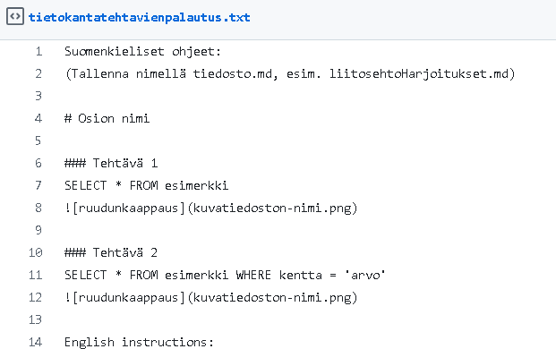

# Teht2

SELECT * FROM taulu WHERE kentta = 'arvo' WHERE joku = 4

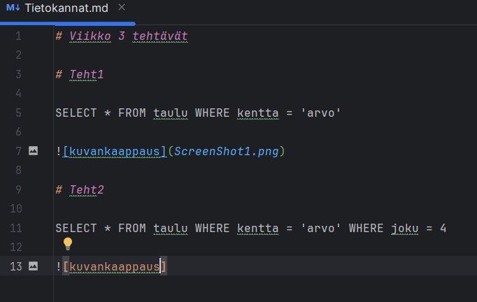

# Viikko2

### Teht 1

SELECT id, name, description, icon, target, target_minvalue, target_maxvalue, target_text FROM goal;

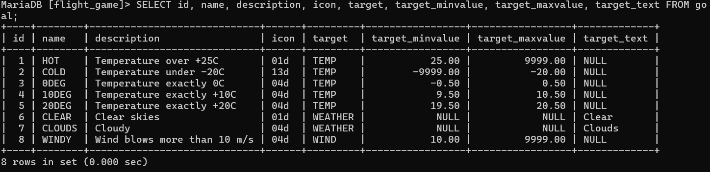

### Teht 2

SELECT name, type FROM airport WHERE iso_country = 'FI';

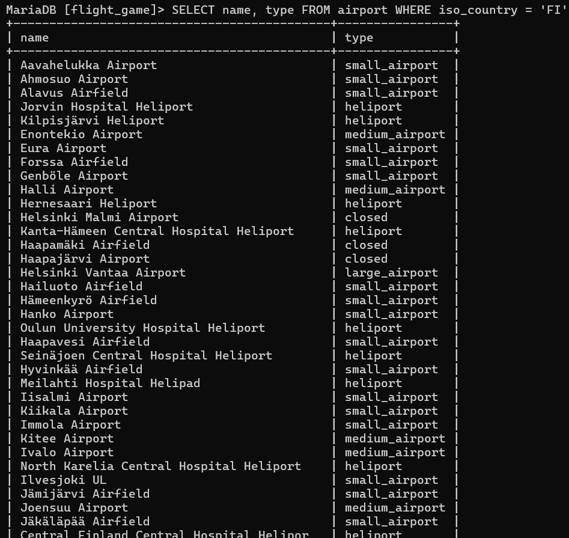

### Teht 3

SELECT name FROM airport WHERE iso_country = 'FI' ORDER BY name ASC;

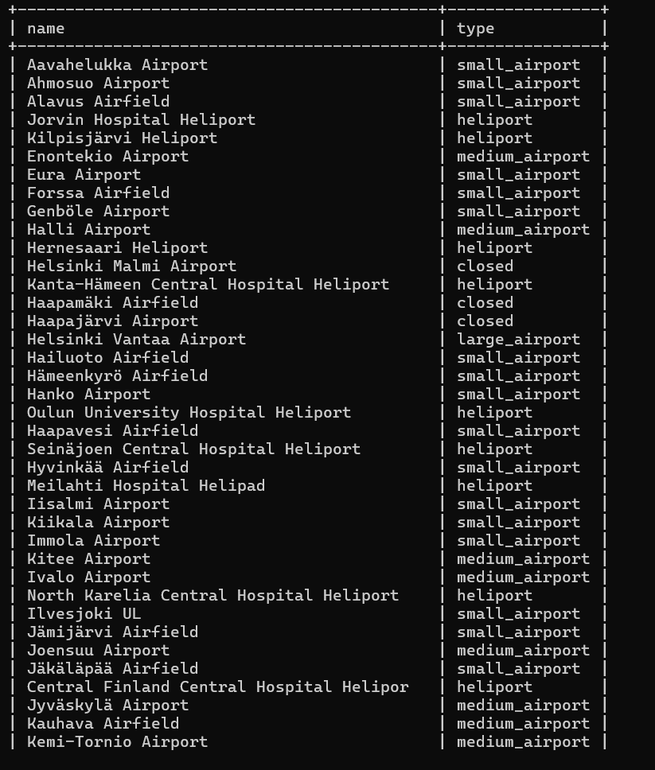

### Teht 4

SELECT name, type FROM airport WHERE iso_country = 'FI' ORDER BY type, name;

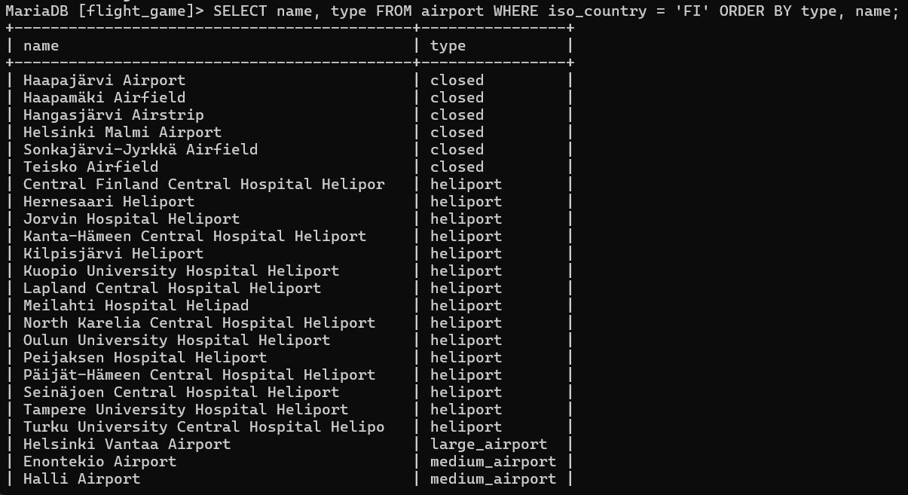

### Teht 5

SELECT name FROM country WHERE name LIKE 'F%';

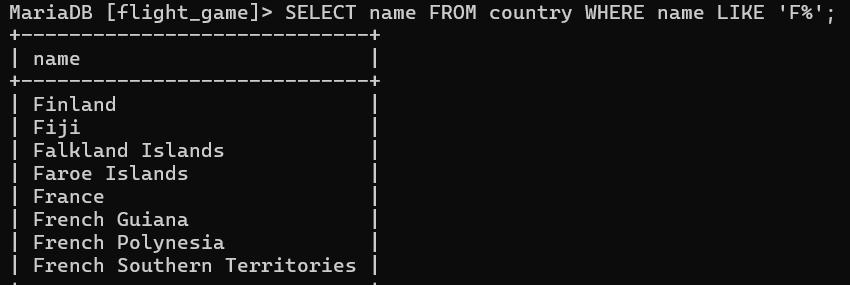

### Teht 6

SELECT name FROM country WHERE name LIKE '%F%';

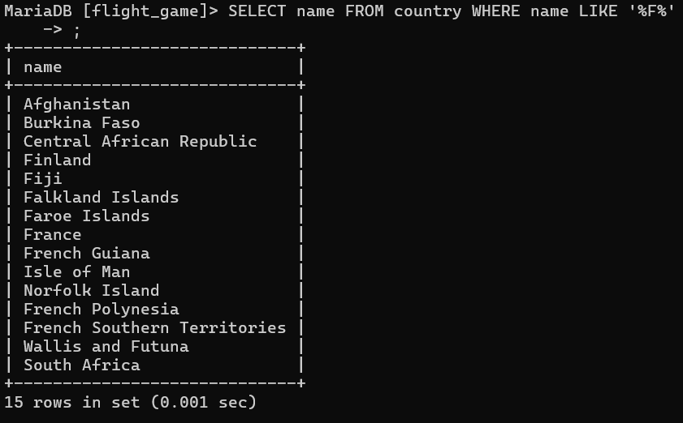

### Teht 7

SELECT location FROm game WHERE screen_name = 'Vesa';

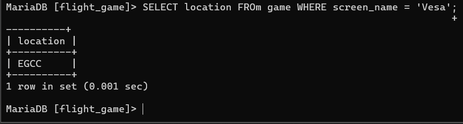

### Teht 8

SELECT co2_consumed FROM game WHERE screen_name = 'Ilkka';

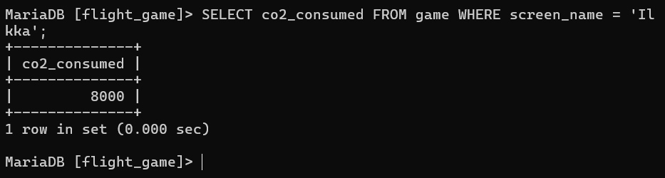

### Teht 9

SELECT co2_budget FROM game LIMIT 1;

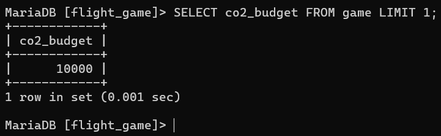